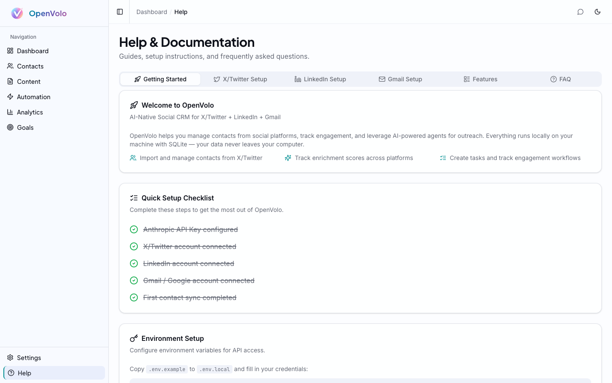

# Getting Started

**From zero to a running CRM in under a minute.**

---

## Why This Is Different

Traditional CRMs take weeks to deploy. You evaluate vendors, sign contracts, configure integrations, import data, train your team. The setup cost alone kills adoption for solo founders and small teams.

OpenVolo takes a page from the indie hacker playbook. Pieter Levels runs [multiple profitable products on SQLite](https://x.com/levelsio/status/1727382446563840368) — no Postgres cluster, no managed database service, just a file on disk. The [local-first software movement](https://www.inkandswitch.com/local-first/), pioneered by Ink & Switch and Martin Kleppmann, argues that the best software owns its data locally and syncs on your terms. OpenVolo embraces both ideas: your CRM is a SQLite file on your machine, your credentials are AES-256 encrypted in a local config, and no data leaves your computer unless you explicitly tell an agent to go fetch something.

## Prerequisites

- **Node.js 20+** — Check with `node --version`
- **A terminal** — Any terminal works: iTerm, Warp, the VS Code integrated terminal
- **API keys** (configured after install):
  - **Anthropic API Key** — Required for AI agents and chat. Get one at [console.anthropic.com](https://console.anthropic.com)
  - **Serper API Key** — Optional, for broad web search (2,500 free queries). Get one at [serper.dev](https://serper.dev)
  - **Tavily API Key** — Optional, for deep research queries (1,000 free/month). Get one at [tavily.com](https://tavily.com)

## Installation

```bash
npx openvolo
```

This single command:
1. Downloads the OpenVolo package
2. Creates `~/.openvolo/` — your data directory
3. Runs database migrations automatically
4. Starts the Next.js server on `http://localhost:3000`

No Docker. No cloud account. No `.env` file to wrestle with (though you can use one if you prefer).

### Your Data Directory

Everything lives in `~/.openvolo/`:

```
~/.openvolo/
  data.db          # SQLite database — your entire CRM
  config.json      # Encrypted API keys and settings
  sessions/        # Browser automation sessions
  media/           # Uploaded images and attachments
```

This is your data. Back it up, move it between machines, or delete it entirely — you're in control.

## Configuring API Keys

Navigate to **Settings** in the sidebar. This is where you connect OpenVolo to the services it needs.


*The Settings page: configure API keys, connect platforms, and manage browser sessions.*

### Anthropic API Key

This powers everything AI in OpenVolo — agents, chat, content generation. You can configure it two ways:

- **Environment variable**: Set `ANTHROPIC_API_KEY` in your shell or in a `.env.local` file
- **Settings page**: Enter it directly in the UI (stored encrypted in `config.json`)

The Settings page shows detection status — green badges for keys found via environment variables, input fields for manual entry.

### Search API Keys (Optional)

OpenVolo uses a smart dual-search system:

- **Serper** — Google-based broad discovery. Great for prospecting and finding new contacts. 2,500 free queries (one-time).
- **Tavily** — Deep research engine. Better for enrichment and detailed person lookup. 1,000 free searches per month.

The agent routing engine automatically picks the right search provider based on the task. You can configure one or both — the system fails over gracefully if a provider is unavailable.

## Connecting Platforms

Below the API key section, you'll find **Platform Connections**. OpenVolo supports three platforms:

- **X / Twitter** — OAuth connection for contact sync and engagement tracking
- **LinkedIn** — OAuth connection for professional network integration
- **Gmail / Google** — OAuth connection for email contact sync

Each connection shows its status (Connected/Disconnected), the signed-in account, granted permissions, and last sync time.

### Browser Enrichment Sessions

At the bottom of Settings, you'll see **Browser Enrichment**. This is a Playwright-powered browser session that logs into X to scrape profile data that APIs can't access. It requires a one-time manual login, after which the session persists for agent use.

## The Help Page

If you're not sure what to do next, click **Help** in the sidebar.


*The Help page: a quick setup checklist, environment setup instructions, and platform-specific guides.*

The Help page includes:
- **Quick Setup Checklist** — Shows completion status for each configuration step (API key, platform connections, first sync)
- **Environment Setup** — Instructions for configuring `.env.local` if you prefer environment variables
- **Platform-specific tabs** — Detailed setup guides for X/Twitter, LinkedIn, and Gmail

## Your Dashboard

Once you've configured at least your Anthropic API key, head to the **Dashboard**.


*The Dashboard: stat cards for contacts, workflows, tasks, and content. Contact pipeline below.*

The dashboard gives you a single-screen overview:

- **Stat cards** — Total contacts, active workflows, pending tasks, content items
- **Contact Pipeline** — Visual funnel distribution across stages: Prospect, Engaged, Qualified, Opportunity, Customer, Advocate
- **Recent Contacts** — Latest additions to your CRM with stage badges
- **Pending Tasks** — Action items needing your attention

The sidebar navigation mirrors the workflow you'll follow through these guides: **Contacts** → **Content** → **Automation** → **Analytics** → **Goals**. Settings and Help are always at the bottom.

## What's Next

Your CRM is running. Your keys are configured. Time to get people into the system.

**Next: [Contacts and Enrichment](02-contacts-and-enrichment.md)** — Import contacts from X and LinkedIn, understand enrichment scores, and let AI fill in the gaps.
