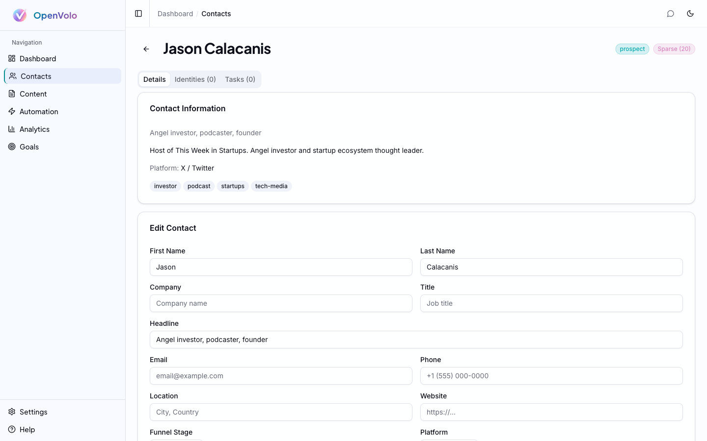

# Contacts and Enrichment

**Every relationship starts with knowing who you're talking to.**

---

## The Missing Piece

Paul Graham wrote that [AI is the missing piece in important, almost-completed puzzles](http://www.paulgraham.com/ace.html). Managing contacts across X and LinkedIn has been one of those puzzles for years. You know the pain: someone DMs you on X, you connect on LinkedIn, you exchange emails — and now that person exists in three places with no unified view. Traditional CRMs tried to solve this with manual data entry and expensive integrations. AI enrichment is the missing piece that finally makes it work.

OpenVolo treats every person as a single record with multiple **identities** — their X handle, LinkedIn profile, email address — all linked to one contact. When an AI agent enriches a contact, it doesn't just add a field; it searches the web, scrapes profiles, and fills in the gaps automatically.

## The Contacts List

The Contacts page is your central directory. Every person in your CRM appears here, regardless of which platform they came from.

*The Contacts list: search, filter by funnel stage, and see enrichment scores at a glance.*

Key features of the contacts list:

- **Search** — Find contacts by name, company, or headline
- **Stage filter** — Filter by funnel stage (All Stages, Prospect, Engaged, Qualified, Opportunity, Customer, Advocate)
- **Show Archived** toggle — Reveal contacts that agents have flagged for pruning (hidden by default)
- **Add Contact** — Manually create a contact or let agents discover them automatically
- **Enrichment scores** — Each contact shows a score from 0-100 indicating data completeness

### Understanding Enrichment Scores

Every contact has an enrichment score that reflects how much OpenVolo knows about them. The score is computed on every write — creating a contact, updating fields, adding identities — so it's always current.

Scores break down intuitively:

| Score Range | Label | What It Means |
|-------------|-------|---------------|
| 0-20 | Sparse | Just a name and platform. Needs enrichment. |
| 21-50 | Basic | Has some fields filled in — company, headline, maybe an email. |
| 51-80 | Good | Multiple identities linked, most fields populated, tags applied. |
| 81-100 | Rich | Fully enriched — bio, location, website, multiple platforms, notes. |

The score isn't vanity. It drives agent behavior. The **Enrich Low-Score Contacts** agent specifically targets contacts with sparse or basic scores and fills in the gaps using web search and browser scraping.

## Contact Detail

Click any contact to see their full profile.

*Contact detail for Jason Calacanis: profile information, platform tags, and editable fields.*

The detail page has three tabs:

### Details Tab
The main profile view shows:
- **Contact Information** — Headline, bio, platform origin, and topic tags (investor, podcast, startups, tech-media)
- **Edit Contact** — All editable fields: name, company, title, headline, email, phone, location, website, funnel stage, platform, and free-form notes
- **Metadata** — Created date, last updated, enrichment score badge

### Identities Tab
A contact's linked profiles across platforms. One person might have:
- An X/Twitter identity (`@handle`)
- A LinkedIn identity (profile URL)
- A Gmail identity (email address)

Identities are how OpenVolo maintains the golden record. When an agent discovers that a contact's X bio mentions their LinkedIn, it can link them automatically.

### Tasks Tab
Action items associated with this contact — follow-up reminders, outreach tasks, demo scheduling. Tasks have priority levels (high, medium, low) and due dates.

## AI-Powered Enrichment

Here's where OpenVolo diverges from every traditional CRM. Instead of paying for a data provider or manually researching each contact, you deploy AI agents.

Navigate to **Automation** and look at the **Enrich** category.

*The Automation dashboard: 10 pre-built agents across Search, Enrich, Prune, Content, Engage, and Outreach categories.*

Two enrichment agents ship out of the box:

### Enrich Low-Score Contacts
Finds contacts with sparse enrichment data and fills in missing fields. The agent:
1. Queries your CRM for contacts below a score threshold
2. Searches the web (via Serper or Tavily) for each person
3. Optionally scrapes their X profile via browser automation
4. Updates contact records with discovered information
5. Recalculates enrichment scores

### Fill Email Gaps
Specifically targets contacts missing email addresses. Uses web search to find professional email patterns and company domains.

Both agents show estimated cost (~$0.50 per run), run count, and last execution time on their cards. Click **Run** to activate, or schedule them to run on a recurring basis (see [AI Agents and Automation](04-ai-agents-and-automation.md)).

## Smart Pruning

Not every contact deserves a spot in your CRM. The **Prune Inactive Contacts** agent evaluates your contact list and archives people who show no recent social activity, invalid profiles, or low engagement potential.

Archived contacts aren't deleted — they're flagged with metadata that records:
- **Who** archived them (which workflow run)
- **Why** (the agent's reasoning)
- **When** (timestamp)

You can restore archived contacts individually from their detail page or in bulk from the workflow run detail page. The "Show Archived" toggle on the contacts list reveals them when you need to review the agent's decisions.

This is the AI equivalent of regularly cleaning your Rolodex, except the AI does the evaluation and you keep veto power.

## Multi-Platform Golden Record

The real power of OpenVolo's contact system is the unified view. A founder you follow on X, connected with on LinkedIn, and emailed through Gmail shows up as **one contact** with three identities. Agents can enrich from any platform and the score reflects the combined data.

This matters because relationships don't live on one platform. The person who engages with your X thread might be the same person your LinkedIn connection introduced you to. OpenVolo keeps that context intact.

## What's Next

You've got contacts in the system and agents enriching them. Now it's time to turn those relationships into content.

**Next: [Content and Publishing](03-content-and-publishing.md)** — Write posts, generate AI drafts, and publish to X and LinkedIn directly from your CRM.

**Also see: [AI Agents and Automation](04-ai-agents-and-automation.md)** — Deep dive into how enrichment agents work under the hood.
