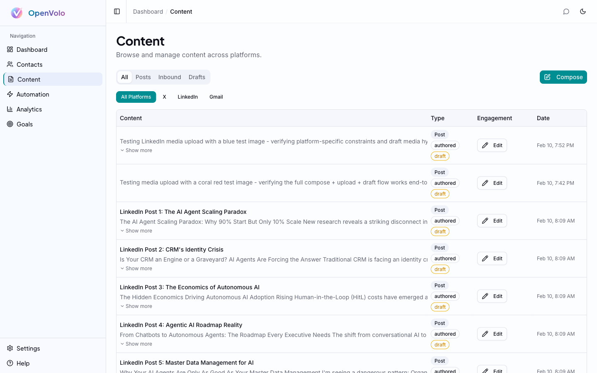
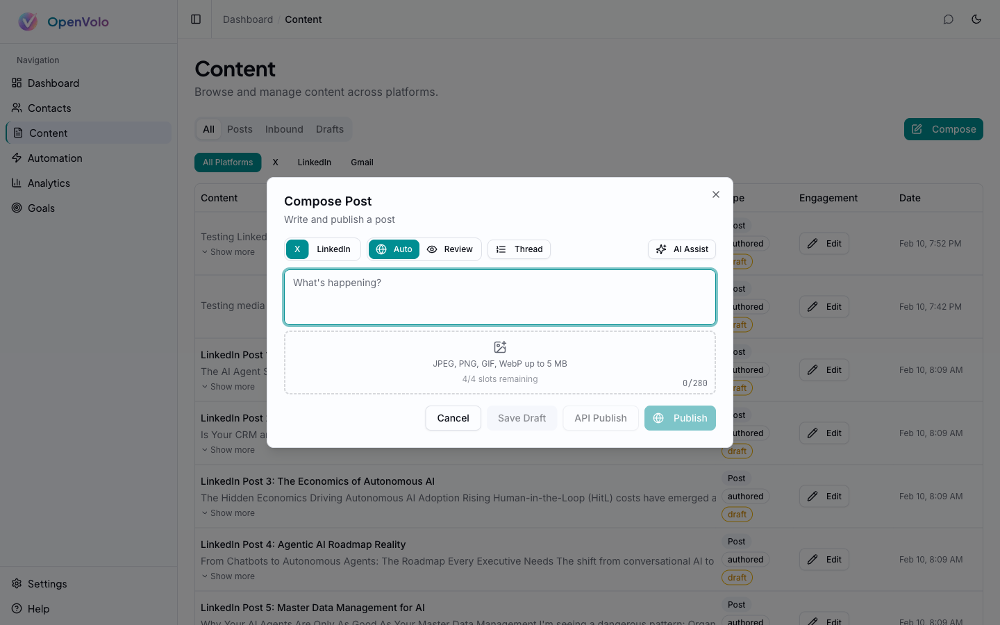
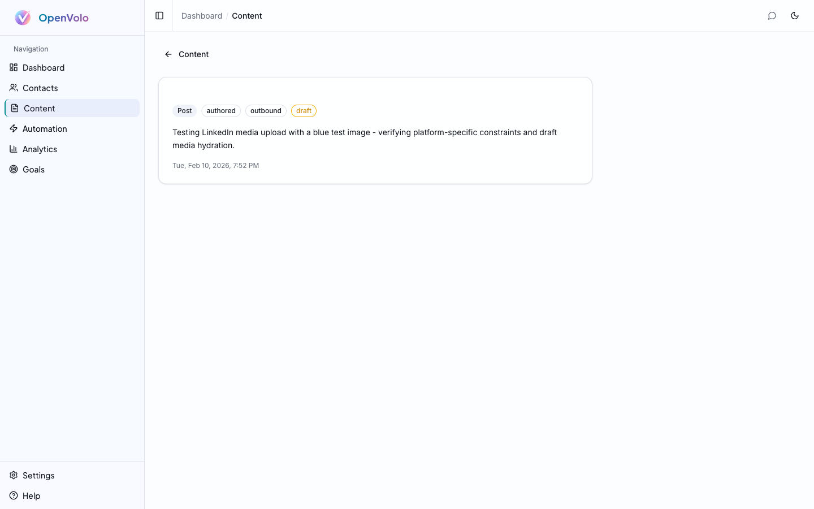

# Content and Publishing

**Build in public. Ship content that compounds. Let AI handle the grind.**

---

## The Content Loop

If you're building a startup, content is how the world finds out. X threads, LinkedIn posts, build-in-public updates — this is the engine that turns followers into customers and connections into collaborators. But the content loop has always been a grind: write, format for each platform, publish, track, repeat. For solo founders, it's the first thing that gets dropped when shipping takes priority.

OpenVolo makes the content loop AI-native. Write once, adapt across platforms, publish through browser automation, and track everything in one library. The AI doesn't replace your voice — it handles the mechanical parts so you can focus on what you actually want to say.

## The Content Library

The Content page is your central hub for everything you've written, drafted, or published.

*The Content library: filter by type (All, Posts, Inbound, Drafts) and platform (X, LinkedIn, Gmail). Each item shows engagement status and timestamps.*

The library supports several views:

- **All** — Every content item across all platforms
- **Posts** — Published content
- **Inbound** — Content others have sent you (replies, mentions)
- **Drafts** — Work in progress, not yet published

Platform filters let you narrow down to X, LinkedIn, or Gmail content. Each item shows its type (Post), authorship (authored/inbound), status (draft/published), engagement data, and creation date.

## Composing Content

Click the **Compose** button to open the compose dialog — the central place for creating new content.

*The Compose dialog: platform selector (X/LinkedIn), publish mode (Auto/Review), thread toggle, media upload, and character count.*

The compose dialog packs a lot into a clean interface:

### Platform Selector
Toggle between **X** and **LinkedIn** at the top. The character counter adjusts automatically — 280 for X, 3,000 for LinkedIn. Platform constraints shape the AI's behavior too, so switching platforms changes how AI Assist generates content.

### Publish Mode
Two modes, inspired by what Andrej Karpathy calls the [autonomy slider](https://karpathy.ai/) — the idea that AI should range from full human control to full autonomy, and you pick the level:

- **Auto** — Headless browser publishing. The agent opens a browser, types your content, attaches media, and publishes. You don't see it happen.
- **Review** — Headed browser mode. The browser opens visibly, fills in your content, and pauses before the final click. You review and confirm.

This is the "Iron Man suit" model of AI assistance. Auto mode is for routine posts you've already reviewed in the compose dialog. Review mode is for high-stakes content where you want to see exactly what's going out.

### Thread Support
Toggle **Thread** mode to compose multi-part X threads. Each segment gets its own text area with an individual character count. Threads are published sequentially through browser automation — the agent posts each part as a reply to the previous one.

### Media Upload
Drag and drop images (JPEG, PNG, GIF, WebP up to 5 MB) into the upload zone. The media system tracks platform-specific constraints — X allows 4 images per tweet, LinkedIn has different dimension requirements. Media thumbnails preview below the upload zone, and you can remove individual attachments before publishing.

### Action Buttons
- **Cancel** — Discard the compose session
- **Save Draft** — Save to your content library without publishing
- **API Publish** — Publish via platform APIs (requires X API Basic tier at $200/month)
- **Publish** — Browser-based publishing (free, works with any account)

## AI-Assisted Content Creation

Click the **AI Assist** button (sparkles icon) to open the AI content panel alongside the compose area.

*AI Assist: three modes (Draft, Suggest, Refine), topic input, tone selection, and optional audience targeting from your contacts.*

AI Assist has three modes, each solving a different part of the content creation problem:

### Draft Mode
Give AI a topic and it generates **three variations** of a complete post. For example, enter "why local-first software matters for startups" and you'll get three distinct takes — different angles, different hooks, different structures. Each variation respects the active platform's constraints (280 chars for X, long-form for LinkedIn).

Controls:
- **Topic** — What should the post be about?
- **Tone** — Professional, Casual, Thought Leader, or Promotional
- **Target audience** — Optionally select contacts from your CRM. The AI tailors the content to resonate with those specific people based on their profile data.

Click **Generate Drafts** and the AI returns three options. Each comes with an **Insert** button that drops the text directly into the compose area.

### Suggest Mode
When you don't have a topic yet, Suggest mode generates **five content ideas** based on a broad theme. Enter "AI and startups" and you'll get specific, actionable post concepts. Each suggestion has a **Use as Topic** button that feeds it back into Draft mode — a two-step ideation-to-draft pipeline.

### Refine Mode
Paste existing text and the AI improves it — tightening language, strengthening hooks, adjusting for the target platform. Useful when you've written a rough draft and want a polish pass before publishing.

## Cross-Platform Adaptation

One of OpenVolo's most practical features: the **Adapt** button (swap icon) in the compose area. Write a post for X, click Adapt, and the AI reformats it for LinkedIn — or vice versa. This isn't just word count adjustment. The AI restructures the content:

- **X → LinkedIn**: Expands the tight X format into LinkedIn's hook-story-insight structure, adds paragraph breaks, extends the narrative
- **LinkedIn → X**: Distills the key insight into 280 characters, sharpens the hook, drops the filler

One click. No copy-paste between tabs. No manual rewriting.

## Browser-Based Publishing

This is where OpenVolo breaks from every other content tool. Instead of requiring expensive API access ($200/month for X API Basic, no LinkedIn write API at all), OpenVolo publishes through actual browser automation.

Here's what happens when you click **Publish**:

1. **Session check** — Verifies your browser session is active (configured in Settings)
2. **Browser launch** — Opens Chromium (headless in Auto mode, visible in Review mode)
3. **Navigation** — Goes to the platform's compose interface
4. **Content entry** — Types your text character-by-character (to trigger platform-specific JS handlers)
5. **Media attachment** — Uploads images through the platform's file input
6. **Publication** — Clicks the post/share button
7. **Verification** — Confirms the post went live by checking for the published URL
8. **Screenshot** — Captures a screenshot of the published post for your records

For X threads, the agent posts each segment as a reply chain. For LinkedIn, it interacts with the Quill rich text editor and share box.

Review mode pauses before step 6, opening the browser window so you can see exactly what's about to be published. This is the trust-building step — you verify the content, media, and formatting look right before the final click.

## Content Detail

Click any content item in the library to see its detail view.

*Content detail: type tags (Post, authored, outbound, draft), full text, and timestamp.*

The detail view shows:
- **Type badges** — Post type, authorship, direction (outbound/inbound), and status (draft/published)
- **Full text** — The complete content without truncation
- **Timestamp** — When it was created or published
- **Edit** — Modify the content, change status, or re-publish

## The Content Workflow in Practice

Here's how a typical content session looks for a solo founder:

1. **Ideate** — Open Compose, click AI Assist, use Suggest mode with a broad theme
2. **Draft** — Pick the best suggestion, Use as Topic, generate three Draft variations
3. **Insert** — Choose the strongest draft, Insert it into the compose area
4. **Edit** — Tweak the AI-generated text with your personal voice and specific details
5. **Adapt** — Click Adapt to create a version for the other platform
6. **Publish** — Hit Publish in Review mode for the first few times, switch to Auto once you trust the flow
7. **Track** — Check your content library to see engagement data flowing in

The entire loop — from blank page to published on both platforms — takes minutes instead of the hour it used to.

## What's Next

Content creation is one side of the coin. The other is automation — agents that create content, engage with your audience, and handle outreach on autopilot.

**Next: [AI Agents and Automation](04-ai-agents-and-automation.md)** — Deploy agents for search, enrichment, content creation, and engagement.

**Also see: [Analytics and Goals](05-analytics-and-goals.md)** — Track content performance and set publishing goals.
