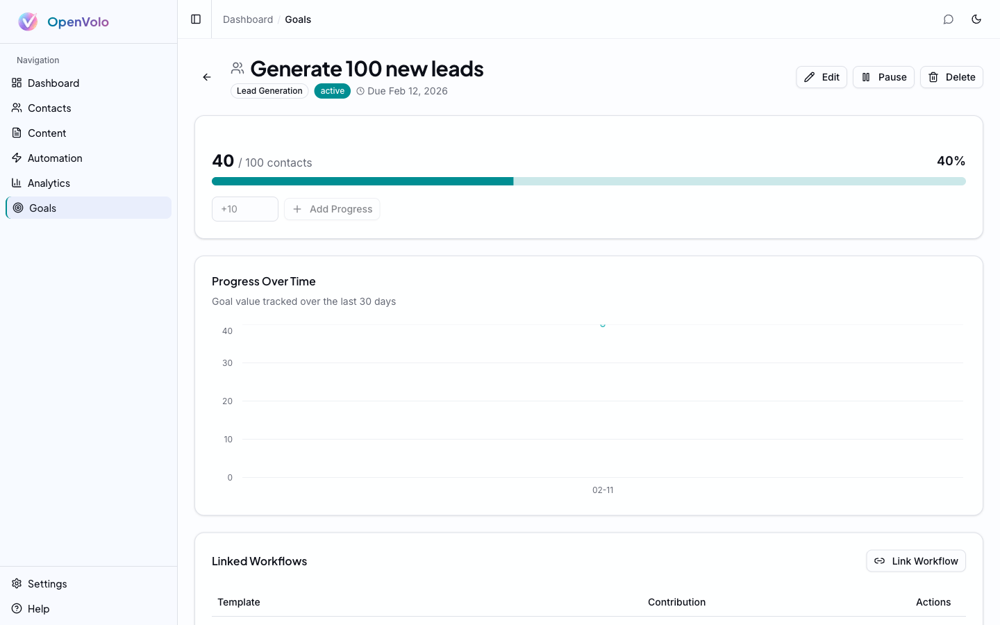

# Analytics and Goals

**Activity is not outcome. Measure what matters.**

---

## Beyond Vanity Metrics

Running agents is activity. Generating leads, publishing content, and building relationships are outcomes. Most CRMs blur this distinction — they show you dashboards full of activity metrics (emails sent, calls logged, workflows run) without connecting them to business results.

Sam Blond, former CRO of Brex, has [argued](https://www.saastr.com/5-interesting-learnings-brex/) that today's top CRM players were built in another era — before AI, before solo founders, before the metrics that matter changed. OpenVolo's analytics and goals system is designed for the way builders actually work: set a target, link the workflows that drive it, and watch auto-computed progress close the gap.

## The Analytics Dashboard

Navigate to **Analytics** in the sidebar to see your CRM's performance data.

*The Analytics dashboard: Contact Growth chart with date range selector. Five tabs cover Overview, Agents, Engagement, Content, and Sync Health.*

The dashboard is organized into five tabs, each answering a different question:

### Overview Tab
**"How is my CRM growing?"**

- **Contact Growth** — Area chart showing new contacts added over time. The tooltip shows exact counts per day.
- **Enrichment Score Distribution** — Bar chart showing how many contacts fall into each score range (Sparse, Basic, Good, Rich). A healthy CRM shifts rightward over time as agents enrich data.
- **Platform Mix** — Donut chart showing contacts by source platform (X, LinkedIn, Gmail). Helps you understand which platform drives the most relationships.

### Agents Tab
**"How are my agents performing?"**

- **Run history** — Timeline of agent executions with success/failure rates
- **Cost breakdown** — Token usage and API costs per agent type
- **Processing stats** — Contacts processed, enriched, archived across all runs

### Engagement Tab
**"How are my contacts interacting?"**

- **Funnel stage distribution** — How contacts move through Prospect → Engaged → Qualified → Opportunity → Customer → Advocate
- **Stage transitions** — Movement between stages over time
- **Top engaged contacts** — Ranked list of most active relationships

### Content Tab
**"How is my content performing?"**

- **Publishing volume** — Posts created and published over time
- **Platform distribution** — Content split across X vs LinkedIn
- **Draft-to-publish ratio** — How many drafts actually ship

### Sync Health Tab
**"Is my data pipeline healthy?"**

- **Last sync times** — When each platform connection last synced
- **Sync errors** — Failed syncs with error details
- **Data freshness** — How current your contact data is

### Date Range Selector

All analytics support a time range filter in the top right: Last 7 days, Last 30 days, Last 90 days, or All time. This lets you zoom in on recent activity or see long-term trends.

## Reading Your Analytics

Here's how to interpret the analytics as a solo founder:

**Contact Growth accelerating** — Your Search agents are finding good prospects. The slope matters more than the absolute number. A steeper curve means your discovery is working.

**Enrichment scores shifting right** — Your Enrich agents are filling data gaps. If most contacts are still "Sparse," you need more enrichment runs. If they're "Good" or "Rich," your data quality is solid.

**Platform mix imbalanced** — If 90% of contacts come from one platform, you might be missing relationships on others. Consider running cross-platform search agents.

**Agent costs climbing** — Check the Agents tab. Each run shows token usage. If a single agent type dominates your costs, you might be over-running it. Scheduling helps spread runs evenly.

## Goal-Driven Demand Generation

Analytics tell you where you are. Goals tell you where you're going. Navigate to **Goals** in the sidebar.

*The Goals dashboard: create targets with type, deadline, and progress tracking. Filter by status (All, Active, Achieved, Paused, Missed).*

### Creating a Goal

Click **Create Goal** and define:

- **Title** — What you're trying to achieve ("Generate 100 new leads", "Publish 50 LinkedIn posts")
- **Type** — Lead Generation, Content Publishing, Engagement, or Custom
- **Target value** — The number you're aiming for
- **Deadline** — When you want to hit it
- **Status** — Active, Paused, Achieved, or Missed

Goals appear as cards showing:
- **Progress bar** — Visual indicator of current vs. target (e.g., 40/100 contacts, 40%)
- **Type badge** — Color-coded category
- **Time remaining** — Days until deadline

### Status Tabs

Filter goals by status:
- **All** — Every goal regardless of status
- **Active** — Currently being worked toward
- **Achieved** — Targets met
- **Paused** — Temporarily suspended
- **Missed** — Deadline passed without hitting the target

## Goal Detail and Auto-Progress

Click into any goal to see its detail page.

*Goal detail for "Generate 100 new leads": 40/100 contacts at 40%, progress chart over time, and linked workflow section.*

The detail page has three sections:

### Progress Tracker
- **Current value** — How much you've achieved so far
- **Progress bar** — Visual percentage
- **Manual adjustment** — Add progress manually with a +/- input and "Add Progress" button

### Progress Over Time
An area chart showing goal value tracked over the last 30 days. This shows whether you're on pace — a flat line means stalled progress, a steep curve means you're ahead of schedule.

### Linked Workflows
The most powerful feature: **connecting workflows to goals**. Click **Link Workflow** to attach an agent template. When a linked workflow completes a run, OpenVolo automatically computes progress and updates the goal.

The auto-progress system counts specific workflow step types per goal type:

| Goal Type | What Counts as Progress |
|-----------|------------------------|
| Lead Generation | New contacts created (`contact_create` steps) |
| Content Publishing | Posts published (`content_publish` steps) |
| Engagement | Contact interactions (`contact_merge`, engagement steps) |

So if your "Generate 100 new leads" goal is linked to the "Top AI Influencers" search agent, every time that agent discovers and creates a new contact, the goal progress increments automatically. No manual tracking. The workflows feed the goal.

### Editing and Managing Goals

The detail page toolbar includes:
- **Edit** — Modify title, target, deadline, or type
- **Pause** — Temporarily suspend tracking
- **Delete** — Remove the goal entirely

## The Goal Workflow in Practice

Here's how a founder would use goals and analytics together:

1. **Set a goal** — "Generate 100 new leads by end of month" (Lead Generation type)
2. **Link workflows** — Attach the Top AI Influencers, Fintech Leaders, and Developer Advocates search agents
3. **Schedule the agents** — Weekly runs for each search agent
4. **Monitor analytics** — Check the Overview tab for contact growth, Agents tab for run costs
5. **Check goal progress** — The progress chart shows daily increments as agents create new contacts
6. **Adjust** — If you're behind pace, increase agent frequency or add more search agents. If you're ahead, redirect effort to enrichment or content.

The goal becomes the organizing principle. Instead of randomly running agents, every run serves a measurable target.

## What's Next

You've set up analytics to understand your CRM and goals to direct it. The final piece is the conversational interface that ties everything together.

**Next: [AI Chat Assistant](06-ai-chat-assistant.md)** — Query analytics, check goal progress, and manage your entire CRM through natural language.
